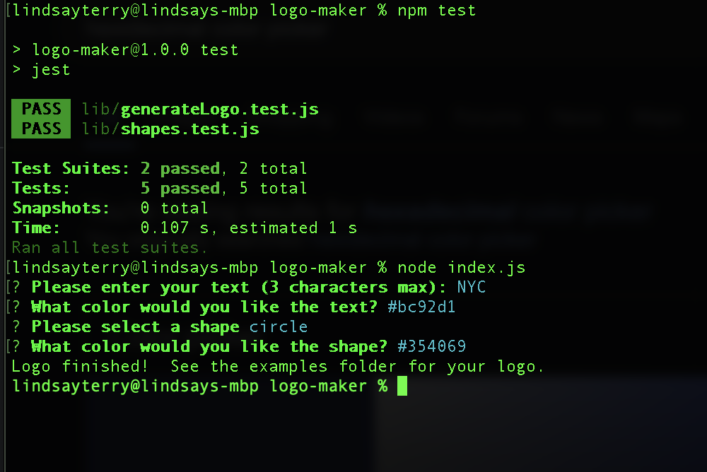

# logo-maker

## Description
This project is a tool to develop simple SVG logos without enlisting the help of a graphic designer.  Simply run the node application and answer a series of questions about what you'd like your logo to look like: 3 letters, a shape, and colors for each, and a logo will be created using all the information you put in. 

I learned a lot working on this project, but the biggest challenge was working with SVG images alongside writing tests.  This was my first time working with SVG and after a lot of research and troubleshooting, I was able to get them to appear in a preview only to find out that my x and y coordinates I put in for everything were totally wrong and not only did I need to update my code to render correctly, but I needed the tests to reflect correct instances of the svg files.  It was challenging to write the test beforehand because I wasn't sure what passing looked like when I set out to write the code, but I definitely learned a lot about the stages of testing and adjusting as you go along for what parts of the vision might change.  

## Table of Contents
* [Installation](#installation)
* [Usage](#usage)
* [License](#license)
* [Contributing](#contributing)
* [Credits](#credits)
* [Tests](#tests)
* [Questions](#questions)

## Installation
Installation instructions for application:
npm i to install dependencies (inquirer for prompts, jest for testing).

## Usage
After cloning or forking the repository and ensuring node is installed and all dependencies, navigate to the repository folder and run node index.js.  From there, a series of questions will populate via console.  The application will ask the user to enter a max of 3 letters for the text on the logo, to enter a color (text or hexidecimal) for the text, and select a shape for the logo to be in.  The final question is choosing a color for the shape, and then a message appears in the console indicating that a logo has been generated and can be found in the examples folder of the repository.  From there, the user can view the raw SVG code and preview the logo.

[Recording of application demonstration](https://drive.google.com/file/d/1o5ln9BgVPqjOfaVM8_SI1O7kEM7-s7xb/view?usp=sharing)

## License
This project is operating under the MIT license.  For more detailed information, please click [here](https://opensource.org/license/mit).

## Contributing
See my contact information in the Questions section below to reach out for contributions.

## Credits
N/A

## Tests
To run tests for the application:
npm test 

## Questions
Contact me for any questions regarding this project:

GitHub: [lindsay-terry](https://github.com/lindsay-terry)

Email: lindsaytee66@gmail.com
